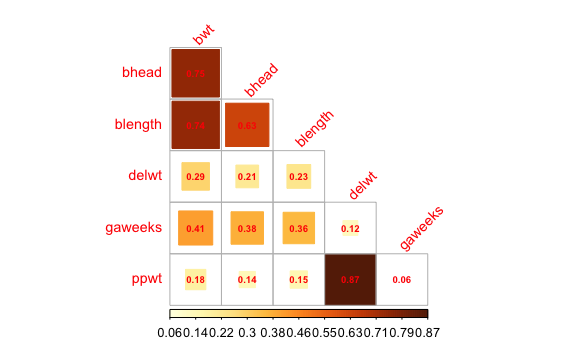

p8105_hw6_nt2607
================
2022-12-01

### Problem 1

For this problem, we’ll use the 2017 Central Park weather data that
we’ve seen elsewhere. The code chunk below (adapted from the course
website) will download these data.

``` r
weather_df = 
  rnoaa::meteo_pull_monitors(
    c("USW00094728"),
    var = c("PRCP", "TMIN", "TMAX"), 
    date_min = "2017-01-01",
    date_max = "2017-12-31") %>%
  mutate(
    name = recode(id, USW00094728 = "CentralPark_NY"),
    tmin = tmin / 10,
    tmax = tmax / 10) %>%
  select(name, id, everything())
```

    ## Registered S3 method overwritten by 'hoardr':
    ##   method           from
    ##   print.cache_info httr

    ## using cached file: ~/Library/Caches/R/noaa_ghcnd/USW00094728.dly

    ## date created (size, mb): 2022-12-01 13:20:52 (8.426)

    ## file min/max dates: 1869-01-01 / 2022-11-30

Step 1. Fit the regression model Step 2. Check r-squared for the model
Step 3. Compute the log(β̂ 0∗β̂ 1)

``` r
#Fit regression
bootstrap_reg = lm(tmax ~ tmin, data = weather_df)
#Check r-squared for the model
bootstrap_reg %>% 
  broom::glance() %>% 
  select(r.squared) %>% 
  knitr::kable()
```

| r.squared |
|----------:|
| 0.9115425 |

``` r
#Compute the log(β̂ 0∗β̂ 1̂) 
bootstrap_reg %>% 
  broom::tidy() %>% 
  select(term, estimate) %>%
  mutate(
    term = case_when(
      term == "(Intercept)" ~ "intercept",
      term == "tmin" ~ "tmin")) %>% 
  pivot_wider(
    names_from = "term",
    values_from = "estimate"
    ) %>% 
  mutate( alpha_beta = log(intercept*tmin))
```

    ## # A tibble: 1 × 3
    ##   intercept  tmin alpha_beta
    ##       <dbl> <dbl>      <dbl>
    ## 1      7.21  1.04       2.01

Now build a bootstrap model for 5000 samples doing everything above.

``` r
bootstrap_weather_df =
weather_df %>% 
  bootstrap(n = 5000) %>% 
  mutate(models = map(strap, ~lm(tmax ~ tmin, data = .x) ),
         square = map(models, broom::glance),
         results = map(models, broom::tidy)
         ) %>% 
  select(-strap, -models)
```

For each bootstrap sample, produce estimates of these two quantities.
Plot the distribution of your estimates, and describe these in words.

For r-squared

``` r
dist_plot_1_df =
bootstrap_weather_df %>% 
  unnest(square) %>% 
  janitor::clean_names() %>% 
  select(r_squared)  # Step 5. produce estimates of these r-squared quantities.
  
dist_plot_1 =   
  dist_plot_1_df %>% 
  ggplot(aes(x = r_squared)) +
  geom_density()
dist_plot_1
```


Description - From the plot we can see that the r-squared values are
almost normally distributed.

For log(β̂ 0∗β̂ 1)

``` r
dist_plot_2_df =
bootstrap_weather_df %>% 
  unnest(results) %>% 
  janitor::clean_names() %>%
  select(id, term, estimate) %>% 
mutate(
    term = case_when(
      term == "(Intercept)" ~ "intercept",
      term == "tmin" ~ "tmin")) %>% 
  pivot_wider(
    names_from = "term",
    values_from = "estimate",
    id_cols = id
    ) %>% 
  mutate( alpha_beta = log(intercept*tmin)) %>% 
  select(alpha_beta) #produced estimates of log(β̂ 0∗β̂ 1)quantities
```

Plot the distribution of the log (β̂ 0∗β̂1) quantities

``` r
dist_plot_2 = 
  dist_plot_2_df %>% 
  ggplot(aes(x = alpha_beta)) +
  geom_density() 
dist_plot_2
```


Description - From the plot we can see that the log of alpha\*beta
values are almost normally distributed.

Using the 5000 bootstrap estimates, identify the 2.5% and 97.5%
quantiles to provide a 95% confidence interval for r̂ 2 and log(β̂ 0∗β̂ 1).

Confidence Intervals for r-squared value and log(β̂ 0∗β̂ 1)̂

``` r
dist_plot_1_df %>% 
  summarize(
    ci_lower_r_squared = quantile(r_squared, 0.025), 
    ci_upper_r_squared = quantile(r_squared, 0.975)) %>% 
  knitr::kable()
```

| ci_lower_r\_squared | ci_upper_r\_squared |
|--------------------:|--------------------:|
|           0.8936684 |            0.927106 |

``` r
dist_plot_2_df %>% 
  summarize(
    ci_lower_log_alpha_beta = quantile(alpha_beta, 0.025), 
    ci_upper_log_alpha_beta = quantile(alpha_beta, 0.975)) %>% 
  knitr::kable()
```

| ci_lower_log_alpha_beta | ci_upper_log_alpha_beta |
|------------------------:|------------------------:|
|                1.964949 |                2.058887 |

### Problem 2

Create a city_state variable (e.g. “Baltimore, MD”), and a binary
variable indicating whether the homicide is solved. Omit cities Dallas,
TX; Phoenix, AZ; and Kansas City, MO – these don’t report victim race.
Also omit Tulsa, AL – this is a data entry mistake. For this problem,
limit your analysis those for whom victim_race is white or black. Be
sure that victim_age is numeric.

``` r
homicide_df = 
  read_csv("data/homicide-data.csv", na = c("", "NA", "Unknown")) %>% 
    mutate(
        city_state = str_c(city, state, sep = "_"),
        victim_age = as.numeric(victim_age),
        resolution = case_when(
        disposition == "Closed without arrest" ~ 0,
        disposition == "Open/No arrest"        ~ 0,
        disposition == "Closed by arrest"      ~ 1,
      )
    ) %>% 
  filter(
    !city_state %in% c("Tulsa_AL", "Dallas_TX", "Phoenix_AZ", "Kansas City_MO"),
    victim_race %in% c("Black", "White")    
    ) %>% 
  select(city_state, resolution, victim_age, victim_race, victim_sex)
```

For the city of Baltimore, MD, use the glm function to fit a logistic
regression with resolved vs unresolved as the outcome and victim age,
sex and race as predictors. Save the output of glm as an R object; apply
the broom::tidy to this object; and obtain the estimate and confidence
interval of the adjusted odds ratio for solving homicides comparing male
victims to female victims keeping all other variables fixed.

Start with one city

``` r
baltimore_df = 
  homicide_df %>% 
  filter(city_state == "Baltimore_MD")
glm(resolution ~ victim_age + victim_race + victim_sex, 
    data = baltimore_df,
    family = binomial()) %>% 
  broom::tidy() %>% 
  mutate(
    OR = exp(estimate),
    CI_lower = exp(estimate - 1.96 * std.error),
    CI_upper = exp(estimate + 1.96 * std.error)
  ) %>% 
  select(term, OR, starts_with("CI")) %>% 
  knitr::kable(digits = 3)
```

| term             |    OR | CI_lower | CI_upper |
|:-----------------|------:|---------:|---------:|
| (Intercept)      | 1.363 |    0.975 |    1.907 |
| victim_age       | 0.993 |    0.987 |    1.000 |
| victim_raceWhite | 2.320 |    1.648 |    3.268 |
| victim_sexMale   | 0.426 |    0.325 |    0.558 |

Now run glm for each of the cities in your dataset, and extract the
adjusted odds ratio (and CI) for solving homicides comparing male
victims to female victims. Do this within a “tidy” pipeline, making use
of purrr::map, list columns, and unnest as necessary to create a
dataframe with estimated ORs and CIs for each city.

Do it for every city in the dataset. First nest the dataset and then fit
the dataset for each city.

``` r
models_results_df =
homicide_df %>%
  nest(data = -city_state) %>% 
  mutate(
    models = map(.x = data, ~glm(resolution ~ victim_age + victim_race + victim_sex, data = .x,
                                family = binomial())),
    results = map(models, broom::tidy)
  ) %>% 
  select(city_state, results) %>% 
  unnest(results) %>% 
  mutate(
    OR = exp(estimate),
    CI_lower = exp(estimate - 1.96 * std.error),
    CI_upper = exp(estimate + 1.96 * std.error)
  ) %>% 
  select(city_state, term, OR, starts_with("CI"))
```

Create a plot that shows the estimated ORs and CIs for each city.
Organize cities according to estimated OR, and comment on the plot.

### Make a plot of the ORs

In each of these 50 cities are male homicide victims more or less likely
to have homicide resolved by arrest compared to female victims.

``` r
models_results_df %>% 
  filter(term == "victim_sexMale") %>% 
  mutate(city_state = fct_reorder(city_state, OR)) %>% 
  ggplot(aes(x = city_state, y = OR)) + 
  geom_point() + 
  geom_errorbar(aes(ymin = CI_lower, ymax = CI_upper)) + 
  theme(axis.text.x = element_text(angle = 90, hjust = 1))
```


### Problem 3

Load and clean the data for regression analysis (i.e. convert numeric to
factor where appropriate, check for missing data, etc.).

``` r
birthweight_df = 
  read_csv("data/birthweight.csv", na = c("", "NA", "Unknown")) %>% 
  janitor::clean_names() %>%
  mutate(
    sex = case_when(
        babysex == 1 ~ "female",
        babysex == 2 ~ "male"),
    father_race = case_when(
        frace == 1 ~ "White",
        frace == 2 ~ "Black",
        frace == 3 ~ "Asian",
        frace == 4 ~ "Puerto Rican",
        frace == 8 ~ "Other",
        frace == 9 ~ "Unknown"),
    malformations = case_when(
        malform == 0 ~ "absent",
        malform == 1 ~ "present"),
    mother_race = case_when(
        mrace == 1 ~ "White",
        mrace == 2 ~ "Black",
        mrace == 3 ~ "Asian",
        mrace == 4 ~ "Puerto Rican",
        mrace == 8 ~ "Other")
  ) %>% 
  mutate(
    sex = as.factor(sex),
    father_race = as.factor(father_race),
    malformations = as.factor(malformations),
    mother_race = as.factor(mother_race)
  ) %>% 
  select(-babysex, -frace, -malform, -mrace)
```

Propose a regression model for birthweight. This model may be based on a
hypothesized structure for the factors that underly birthweight, on a
data-driven model-building process, or a combination of the two.
Describe your modeling process and show a plot of model residuals
against fitted values – use add_predictions and add_residuals in making
this plot.

#### Hypothesis

I want to see what are the factors that would significantly affect
birthweight of a baby and length of a baby at birth.

Step 1 - There are several other factors that confounds relationship and
for the purpose of this homework I am trying to fit the best model based
on the variables available in this data set. Here are some of the
variables that I hypothesize based on what I think are the most
influential factors to affect the relationship between birthweight and
length at birth.

`sex`: baby’s sex (male = 1, female = 2) `bhead`: baby’s head
circumference at birth (centimeters) `blength`: baby’s length at birth
(centimeteres) `bwt`: baby’s birth weight (grams) `delwt`: mother’s
weight at delivery (pounds) `gaweeks`: gestational age in weeks
`malformations`: presence of malformations that could affect weight (0 =
absent, 1 = present) `mother_race`: mother’s race (1 = White, 2 = Black,
3 = Asian, 4 = Puerto Rican, 8 = Other) `ppwt`: mother’s pre-pregnancy
weight (pounds) `smoken`: average number of cigarettes smoked per day
during pregnancy

Step 2 - is dropping variables that are strongly associated with other
predictors (for this we check the r-squared). I know I want to keep
`sex`, `smoken`, `mother_race` and `malformations` in the model. I check
for co-linearity among other variables.

#### Collinearity co-matrix

``` r
birthweight_df_cor =
birthweight_df %>%
  dplyr::select(bwt, bhead, blength, delwt, gaweeks, ppwt)
  birthweight_df_cor %>%
  cor() %>%
  corrplot::corrplot(type = "lower",
                     method = "square",
                     addCoef.col = "red",
                     diag = FALSE,
                     number.cex = .6,
                     tl.col = "red",
                     tl.cex = .9,
                     tl.srt = 45,
                     is.corr = FALSE)
```



From this model I can see that `bhead` is extremely collinear with
`blength` so I’ll remove `bhead` from the model. Similarly, `ppwt` is
collinear with `gaweeks`. I’ll remove `ppwt` from the model.

Final fitted model -
